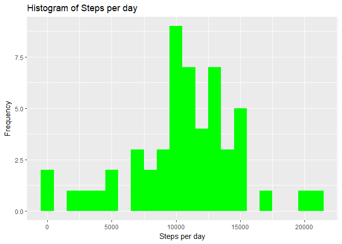
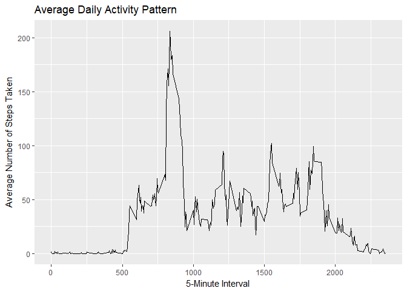
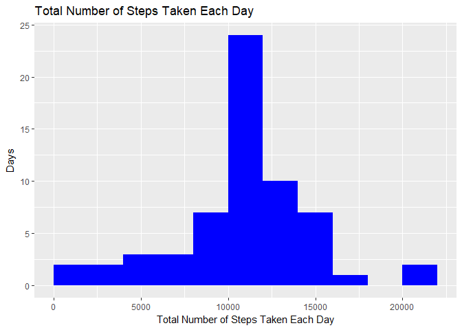
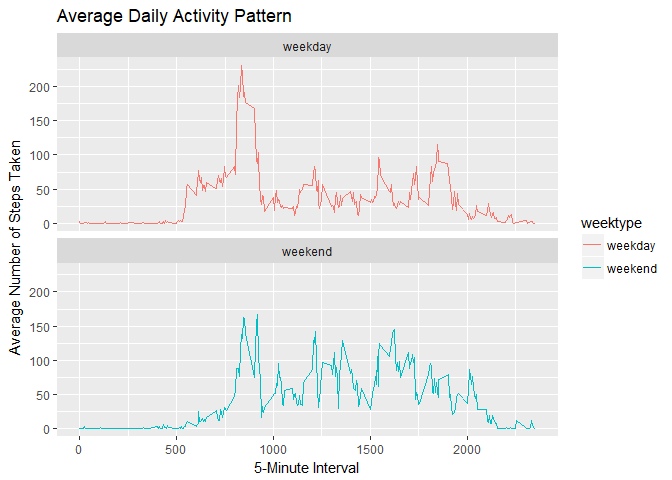

Pablo Garcia

## Loading libraries

```r
library(ggplot2)
library(lubridate)
```

```
## 
## Attaching package: 'lubridate'
```

```
## The following object is masked from 'package:base':
## 
##     date
```

```r
library(dplyr)
```

```
## 
## Attaching package: 'dplyr'
```

```
## The following objects are masked from 'package:lubridate':
## 
##     intersect, setdiff, union
```

```
## The following objects are masked from 'package:stats':
## 
##     filter, lag
```

```
## The following objects are masked from 'package:base':
## 
##     intersect, setdiff, setequal, union
```

```r
# change default display format
options(scipen=999)
# For some problems in system time
Sys.setlocale(locale = "C")
```

## Loading and preprocessing the Data

```r
if(!file.exists("activity.csv")){
        unzip("activity.zip")
}
activitydata <- read.csv("activity.csv",colClasses = c("numeric", "Date", "numeric"), stringsAsFactors = FALSE)
#activitydata$date <- ymd(activitydata$date)
```

## What is mean total number of steps taken per day?
Calculate 


```r
steps <- activitydata %>%
  group_by(date) %>%
  summarise(steps = sum(steps, na.rm = FALSE))
  head(steps)
```

```
## # A tibble: 6 x 2
##   date       steps
##   <date>     <dbl>
## 1 2012-10-01    NA
## 2 2012-10-02   126
## 3 2012-10-03 11352
## 4 2012-10-04 12116
## 5 2012-10-05 13294
## 6 2012-10-06 15420
```

Plot histogram


```r
ggplot(steps, aes(x = steps)) +
  geom_histogram(fill = "green", binwidth = 1000, na.rm = TRUE) +
  labs(title = "Histogram of Steps per day", x = "Steps per day", y = "Frequency")
```

<!-- -->

## What is the average daily activity pattern?
Calculate the total number of steps taken per day


```r
average <- activitydata %>% group_by(interval) %>% summarize(avg = mean(steps, na.rm = T))
head(average)
```

```
## # A tibble: 6 x 2
##   interval    avg
##      <dbl>  <dbl>
## 1     0    1.72  
## 2     5.00 0.340 
## 3    10.0  0.132 
## 4    15.0  0.151 
## 5    20.0  0.0755
## 6    25.0  2.09
```

Plot of the average number of steps 


```r
g <- ggplot(average, aes(interval, avg, group = 1)) + geom_line(na.rm = TRUE)
g + labs(title = "Average Daily Activity Pattern") + labs(x = "5-Minute Interval", y = "Average Number of Steps Taken")
```

<!-- -->

Find out the 5-minute interval containing the maximum number of steps on average across all the days in the dataset.


```r
average[which.max(average$avg), 1]
```

```
## # A tibble: 1 x 1
##   interval
##      <dbl>
## 1      835
```

## Imputing missing values
Calculate the total number of missing values in the dataset.


```r
total_missing <- sum(is.na(activitydata$steps))
```
The total number of missing values is **2304**

Impute missing values with the mean for that 5-minute interval.


```r
activitydata.na <- activitydata[is.na(activitydata$steps), ]
activitydata[is.na(activitydata$steps), 1] <- average[average$interval %in% as.character(activitydata.na[, 3]), 2]
head(activitydata)
```

```
##       steps       date interval
## 1 1.7169811 2012-10-01        0
## 2 0.3396226 2012-10-01        5
## 3 0.1320755 2012-10-01       10
## 4 0.1509434 2012-10-01       15
## 5 0.0754717 2012-10-01       20
## 6 2.0943396 2012-10-01       25
```

Make a histogram of the total number of steps taken each day.


```r
sum <- activitydata %>% group_by(date) %>% summarize(total = sum(steps))
g <- ggplot(sum, aes(total)) + 
  geom_histogram(binwidth = 2000, boundary = 0, na.rm = TRUE, fill = "blue")  
g + labs(title = "Total Number of Steps Taken Each Day") + 
  labs(x = "Total Number of Steps Taken Each Day", y = "Days")
```

<!-- -->

Calculate the mean and median total number of steps taken per day:

 - **Mean  : 10766.1886792**
 - **Median: 10766.1886792**

## Are there differences in activity patterns between weekdays and weekends?

Create a new factor variable in the dataset with two levels - "weekday" and "weekend" indicating whether a given date is a weekday or weekend day.


```r
activitydata <- mutate(activitydata, weektype = ifelse(weekdays(activitydata$date) == "Saturday" | weekdays(activitydata$date) == "Sunday", "weekend", "weekday"))
activitydata$weektype <- as.factor(activitydata$weektype)
head(activitydata)
```

```
##       steps       date interval weektype
## 1 1.7169811 2012-10-01        0  weekday
## 2 0.3396226 2012-10-01        5  weekday
## 3 0.1320755 2012-10-01       10  weekday
## 4 0.1509434 2012-10-01       15  weekday
## 5 0.0754717 2012-10-01       20  weekday
## 6 2.0943396 2012-10-01       25  weekday
```

Split the data frame by the day factor and summarize them respectively. Then bind then together and adding day factor as the third column.


```r
interval_full <- activitydata %>%
        group_by(interval, weektype) %>%
        summarize(steps = mean(steps))
```

Make a panel plot containing a time series plot of the 5-minute interval (x-axis) and the average number of steps taken, averaged across all weekday days or weekend days (y-axis).


```r
print( ggplot(interval_full, aes(x=interval, y=steps, color=weektype))+
       geom_line() + facet_wrap(~weektype, ncol = 1, nrow = 2)+ 
       labs(title = "Average Daily Activity Pattern") + labs(x = "5-Minute Interval", y = "Average Number of Steps Taken")
)
```

<!-- -->
